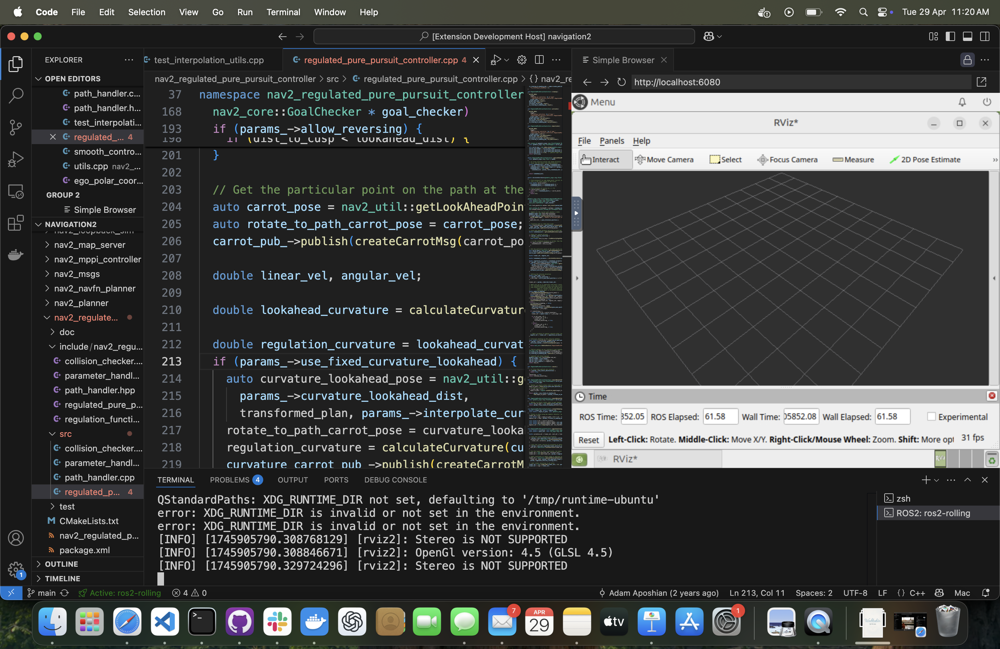

# 🤖 ros2env - Simplifying ROS2 Development

**ros2env** is a Visual Studio Code extension that helps you manage isolated ROS2 environments with ease - start, stop, switch, and interact with them directly from your editor.

Whether you're working on multiple ROS2 projects or want to simplify environment switching, ros2env provides a seamless developer experience inside VS Code.

🌐 [Visit the Landing Page](https://sakshaymahna.github.io/ros2env/) – Explore features, guides, and videos in one place.

---

## 🎥 Demonstration Videos

### 🎥 [Demo Video (Watch here)](https://youtu.be/L_r-QvbI5Dc)

### 🎥 [Step by Step Installation Video (Watch here)](https://youtu.be/mt8DTLkWNyA)

---

## ✨ Why ros2env?

- 🚀 No more conflicting ROS2 installations
- 🐳 Docker powered isolation (fully abstracted)
- 🔄 Seamless environment switching
- 💻 Works across Windows, Mac and Linux
- 🖥️ GUI tools accessible via browser (RViz, Gazebo, etc.)

---

## 🚀 Features

- 🔍 Discover available ROS2 environments
- ▶️ Start or stop environments with one command
- 🧠 Open a ready-to-use terminal inside the environment workspace (`ros2_ws`)
- 🪟 Launch GUI apps from your environment (via browser-based interface)
- ➕ Create or 🗑️ delete environments easily
- 🧭 Treat each environment like a virtual ROS2 workspace

---

## 🧰 Requirements

Before using **ros2env**, ensure the following is installed on your system:

- [Visual Studio Code](https://code.visualstudio.com/) ( >= v1.80.0)
- [Docker](https://docs.docker.com/get-docker/) (used under the hood)
- OR **WSL Docker** (if you're using Windows Subsystem for Linux)

> 💡 *Docker is required to isolate and manage environments behind the scenes. You don't need to know Docker to use ros2env.*

---

## 📦 Installation

Simply search for **ros2env** in the [VS Code Marketplace](https://marketplace.visualstudio.com/) and click install.

---

## 🧪 Getting Started

### ➕ 1. Create a new ROS2 Environment
1. Open the **Command Palette** (`Ctrl+Shift+P` or `Cmd+Shift+P` on Mac)
2. Run: `ROS2: Create Environment`
3. Enter a name for your new environment (e.g., `my_ros2env`)
4. Choose a ROS 2 distro (e.g., `rolling`, `humble`, etc.)
5. Wait for setup to complete (you’ll see progress)

🎉 A new isolated ROS2 environment will be created with a ready-to-use workspace.

### 🔁 2. Load (Switch to) an Environment
1. Open Command Palette again
2. Run: `ROS2: Load Environment`
3. Select one of your previously created environments

This will:
- Start the environment (if stopped)
- Stop any running environment (if different)
- Attach an interactive terminal inside `ros2_ws`

### 💻 3. Open a ROS 2 Terminal
- Run: `ROS2: Open Terminal`
- This opens a terminal already inside your ROS2 workspace

You're ready to build, source, and run ROS2 nodes like usual.

### 🖥️ 4. Launch GUI Tools
- Run: `ROS2: Open GUI`
- This opens a browser tab with access to graphical tools (RViz, Gazebo, etc.)

> GUI support is provided via an embedded desktop accessible through your browser.

### 🛑 5. Stop an Environment
- Run: `ROS2: Stop Environment`
- This shuts down the running environment and closes terminals

### 🗑️ 6. Delete an Environment
- Run: `ROS2: Delete Environment`
- Select one or more environments to remove permanently

⚠️ This will stop and delete the selected environments. Use with caution.

---

## 💬 Support and Feedback

- Have questions? [Join Discussions](https://github.com/SakshayMahna/ros2env/discussions)
- Found a bug? [Report an Issue](https://github.com/SakshayMahna/ros2env/issues)

---

## 🛡️ License

MIT License © Sakshay Mahna

---

## 🧩 Related Links

- 🌐 [Landing Page](https://sakshaymahna.github.io/ros2env/)
- 📦 [VSCode Marketplace Extension Page](https://marketplace.visualstudio.com/items?itemName=SakshayMahna.ros2env)
- 📄 [Discussions / Feedback](https://github.com/SakshayMahna/ros2env/discussions)
- 🛠️ [Report an Issue](https://github.com/SakshayMahna/ros2env/issues)